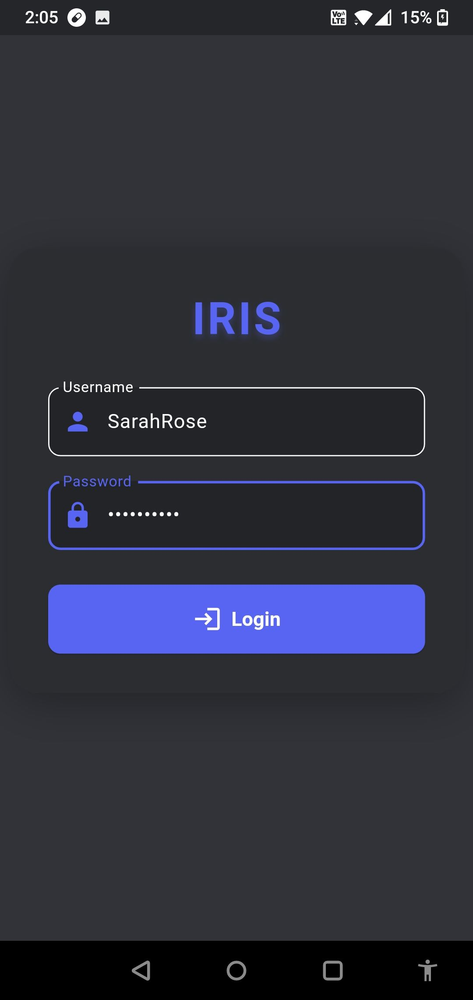
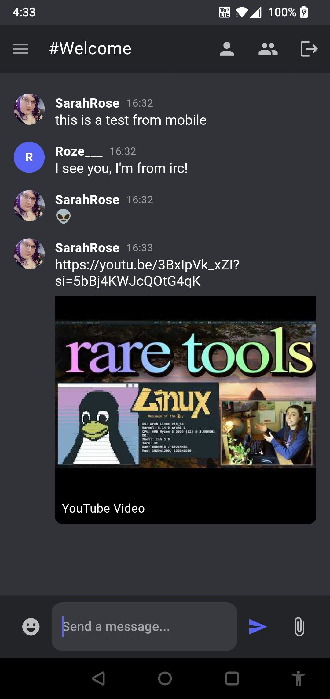
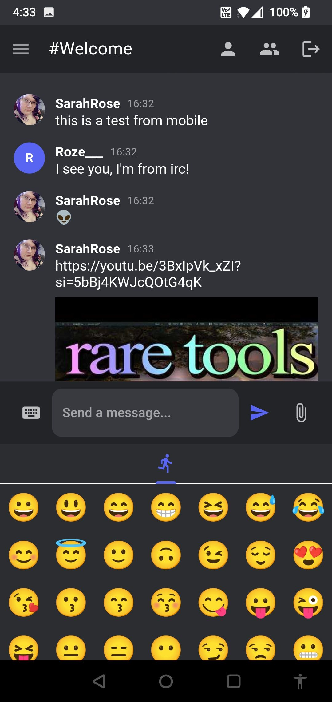

# IRIS - IRC Interface System

**Modern chat, timeless protocol.**

Iris is a sleek, mobile-first chat application that brings modern UX to the IRC protocol. Featuring a clean, Discord-inspired interface, Iris makes traditional IRC networks feel like modern chat platforms. Built with a Go-based gateway and a Flutter-powered client, Iris adds support for images, avatars, and real-time messaging---all while staying true to IRC fundamentals.

---

✨ Features
----------

-   📱 **Beautiful Android client** with modern chat UI
-   🌐 **Gateway server** connects to an Ergo IRC Server
    -   Places a WebSocket interface between IRC and the Flutter/Android client
    -   Supports ProxyProtocol v1 to forward the client IP to the IRC server
-   🔐 **NickServ authentication** for secure identity
-   🖼️ **Embedded media support**, including avatars and image file attachments
    -   Images are stored for 12 hours (configurable in `config.go`)
-   💬 **Discord-style experience** with channel list, private messages, and real-time updates
    -   Channel list stays synced with joined channels
    -   DMs and other UX elements are under active development
-   🌙 **/away and /back support**
    -   Automatically sets you as away when the app is backgrounded or the phone is put to sleep
    -   Keeps you connected for push notifications while showing accurate presence in IRC
-   🤖 **Gateway-integrated bot for enhanced history and presence tracking**
    -   The bot joins channels and can be invited to private rooms
    -   Enables better message history and archival features
-   🛠️ **Many UI fixes** for improved responsiveness, layout, and stability
-   🔔 **Discord-like push notifications** now fully working!
-   👥 **Dynamic member list** updates live on join/part events
-   🔄 **Session restore**: Seamlessly reload your chat state and sync across devices/SASL accounts
-   📩 **Direct messages** (DMs) are fully working
-   🕹️ **Tap and hold on channels to leave/part**

---

## 🚧 Upcoming Features

-   ⛔ **Blocking users**
-   📝 **Edit messages** (updates message in IRC; app updates in place, like Discord)
-   😃 **Emoji picker** (returning soon!)
-   🔔 **Improved DM notifications**
-   👫 **Friends list**
-   🔒 **Encrypted DMs or channels** (research/investigation ongoing)

---

## 📸 Screenshots

### Login Screen

### Logged-In Interface

### Emoji Support (Plain Text Emoji Only)

---

## 🛠️ Tech Stack

- **Frontend:** Flutter
- **Backend Gateway:** Go
- **Protocol:** IRC + custom metadata layer
- **Auth:** Ergo IRC API (`/v1/check_auth`)

---

**More features and improvements coming soon!**